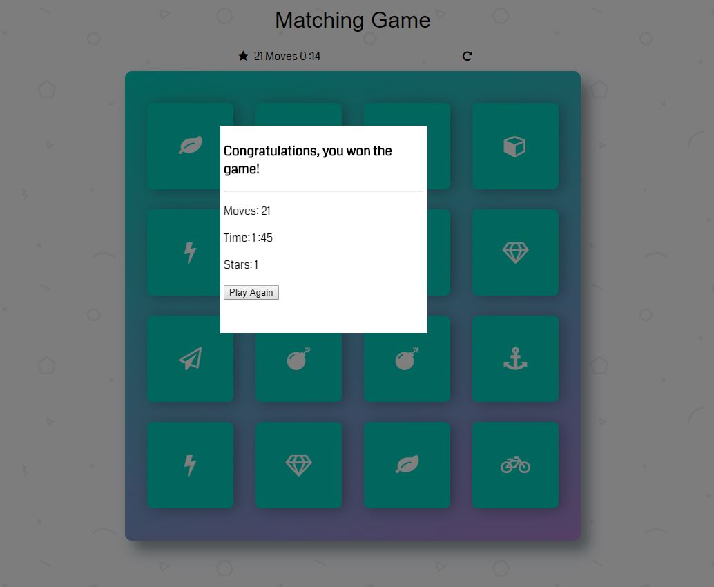

# Memory Game Project

## Table of Contents

* [About this App](#AboutThisApp)
* [How to Play](#HowToPlay)

## AboutThisApp

The memory game was created during my front end nanodegree from Udacity. They provided starter code with some cards flipped and the CSS styling. The starter code was static. We were to convert the project to become interactive, create a scoring system with the stars and create a modal after winning. 

## HowToPlay

Download or clone repository, extract the .zip file and open index.html in browser.

Click on two cards, if they match they stay up, if not they flip back over. When you have all 8 matches the game is won. You lose a star every 10 turns.
    
This game uses JavaScript and JQuery.

